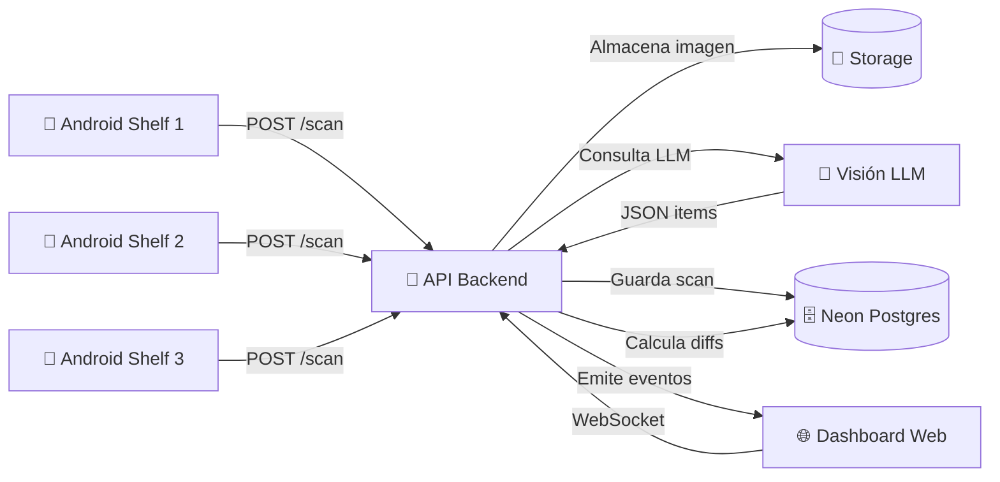

# Smart Trolley (phone-powered) — Documentación del MVP

---

## 🔄 IMPORTANTE: Transformación del Proyecto en Curso

Este proyecto está en proceso de transformación de un sistema basado en **fotos estáticas con OpenAI** a un sistema de **video en tiempo real con Google Gemini API**.

**📘 Para información sobre la transformación, consulta**: [`TRANSFORMACION_README.md`](./TRANSFORMACION_README.md)

**Documentos de transformación disponibles**:
- [`GUIA_DE_TRANSFORMACION.md`](./GUIA_DE_TRANSFORMACION.md) - Guía completa de implementación
- [`TRANSFORMATION_PROMPT.md`](./TRANSFORMATION_PROMPT.md) - Prompt técnico para Cursor AI
- [`RESUMEN_EJECUTIVO_CAMBIOS.md`](./RESUMEN_EJECUTIVO_CAMBIOS.md) - Resumen ejecutivo
- [`META_PROMPT_PARA_CHATGPT.md`](./META_PROMPT_PARA_CHATGPT.md) - Template reutilizable

---

## Resumen Ejecutivo

### El Problema
El proceso de **Pick & Pack** en operaciones de fulfillment es manual, contrarreloj y propenso a errores. Los operadores deben preparar trolleys (carritos) con productos específicos según los requisitos de cada vuelo, enfrentando:
- **Faltantes**: productos que debían estar pero no se incluyeron
- **Excedentes**: productos que no se solicitaron pero se agregaron
- **Presión de tiempo**: ventanas cortas para preparar y despachar
- **Falta de trazabilidad**: difícil auditar qué salió mal y dónde

### Objetivo del Proyecto
**"Make Pick & Pack smarter, faster, and more sustainable"** mediante visión por computadora.

Desarrollar un MVP que permita:
1. Captura automática de imágenes de trolleys en movimiento
2. Detección de SKUs y cantidades mediante Visión LLM
3. Comparación en tiempo real contra requisitos planificados
4. Alertas inmediatas de discrepancias
5. Dashboard con KPIs operativos y de exactitud

### Enfoque Técnico

El sistema utiliza:
- **3 teléfonos Android fijos** (uno por repisa del trolley)
- **Captura automática** de foto cada 5 segundos
- **Backend con Visión LLM** (modelo multimodal) que analiza imágenes y retorna JSON estructurado
- **Comparación automática** contra `flight_requirements` en base de datos
- **Dashboard web** con KPIs en tiempo real y alertas visuales
- **Comunicación en vivo** vía WebSocket/SSE

### Tecnologías Clave

| Componente | Tecnología |
|------------|-----------|
| **Mobile** | React Native + Expo (Android kiosk mode) |
| **Backend** | Node.js + Express + Neon Postgres |
| **Visión LLM** | Modelo multimodal con salida JSON Schema |
| **Web Dashboard** | Next.js + Tailwind CSS |
| **Tiempo Real** | WebSocket / Server-Sent Events |
| **Storage** | Local filesystem o S3-compatible |
| **Base de Datos** | PostgreSQL (Neon serverless) |

### Arquitectura de Alto Nivel



### Estructura de este Repositorio

```
/
├─ docs/              → Documentación técnica y operativa
│  ├─ architecture/   → Diagramas, modelos de datos, ADRs
│  ├─ api/            → Contratos de API y schemas
│  ├─ flows/          → Flujos operativos y técnicos
│  ├─ kpis/           → Métricas y KPIs del sistema
│  ├─ setup/          → Guías de configuración por componente
│  ├─ security-privacy/ → Privacidad, costos, retención
│  ├─ ops/            → Hardware, montaje, iluminación
│  ├─ demo/           → Script de demostración y criterios de éxito
│  ├─ risk/           → Registro de riesgos y mitigaciones
│  ├─ planning/       → Roles, tareas, milestones para 36h
│  └─ references/     → Guías de catálogo SKU y configuración
├─ apps/              → READMEs de cada aplicación (sin código)
└─ packages/          → README de componentes compartidos
```

### Navegación Rápida

#### 📋 Inicio
- [Visión General del Proyecto](docs/overview.md)
- [Glosario de Términos](docs/glossary.md)

#### 🏗️ Arquitectura
- [Arquitectura de Contexto](docs/architecture/context-architecture.md)
- [Modelo de Datos](docs/architecture/data-model.md)
- [Secuencia de Scan](docs/architecture/sequence-scan.md)
- [Decisiones de Arquitectura (ADRs)](docs/architecture/decisions-adr-index.md)

#### 🔌 API y Contratos
- [Contratos de API](docs/api/contracts.md)
- [JSON Schema para Visión LLM](docs/api/vision-json-schema.md)

#### 🔄 Flujos
- [Flujo Operativo](docs/flows/operational.md)
- [Flujo Técnico de Scan](docs/flows/technical-scan.md)

#### 📊 Métricas
- [KPIs y Métricas](docs/kpis/kpis-metrics.md)

#### ⚙️ Configuración
- [Neon Postgres](docs/setup/neon-postgres.md)
- [Variables de Entorno](docs/setup/env-variables.md)
- [Mobile Expo Setup](docs/setup/mobile-expo-setup.md)
- [Dashboard Next Setup](docs/setup/dashboard-next-setup.md)
- [API Express Setup](docs/setup/api-express-setup.md)

#### 🔒 Seguridad y Privacidad
- [Privacidad y Costos](docs/security-privacy/privacy-costs.md)
- [Retención de Datos](docs/security-privacy/data-retention.md)

#### 🔧 Operaciones
- [Montaje de Hardware](docs/ops/hardware-mounting.md)
- [Iluminación y FOV](docs/ops/lighting-and-fov.md)
- [Etiquetado QR](docs/ops/qr-labeling.md)

#### 🎬 Demo
- [Script de Demostración](docs/demo/demo-script.md)
- [Criterios de Éxito](docs/demo/success-criteria.md)

#### ⚠️ Riesgos
- [Registro de Riesgos](docs/risk/risk-register.md)
- [Mitigaciones](docs/risk/mitigations.md)

#### 📅 Planificación
- [Roles y Tareas (36h)](docs/planning/roles-and-tasks-36h.md)
- [Checklist de Hoy](docs/planning/today-checklist.md)
- [Milestones por Hora](docs/planning/milestones.md)

#### 📚 Referencias
- [Guía de Catálogo SKU](docs/references/sku-catalog-guidance.md)

### Componentes del Sistema

- [Mobile Shelf App](apps/mobile-shelf/README.md) — Aplicación Android para captura en cada repisa
- [Dashboard Web](apps/dashboard/README.md) — Panel de control y monitoreo
- [API Backend](apps/api/README.md) — Servidor de procesamiento y lógica de negocio
- [UI Package](packages/ui/README.md) — Componentes compartidos (opcional)

---

## ⚠️ Nota Importante: Solo Documentación

Este repositorio contiene **ÚNICAMENTE documentación en formato Markdown**. No incluye:
- ❌ Código fuente (.ts, .js, .tsx, .py, etc.)
- ❌ Archivos de configuración (package.json, tsconfig.json, etc.)
- ❌ Pipelines de CI/CD (.yml, .yaml)
- ❌ Lockfiles (package-lock.json, yarn.lock)
- ❌ Binarios o ejecutables

El propósito es servir como **especificación técnica completa** para el desarrollo del MVP durante HackMTY.

---

## Contribuciones y Uso

Este proyecto fue desarrollado para **HackMTY x GateGroup** como documentación guía para construir un MVP de Smart Trolley en 36 horas.

**Licencia**: Documentación de uso interno para el hackathon.

**Contacto**: Equipo GateGroup Smart Trolley
