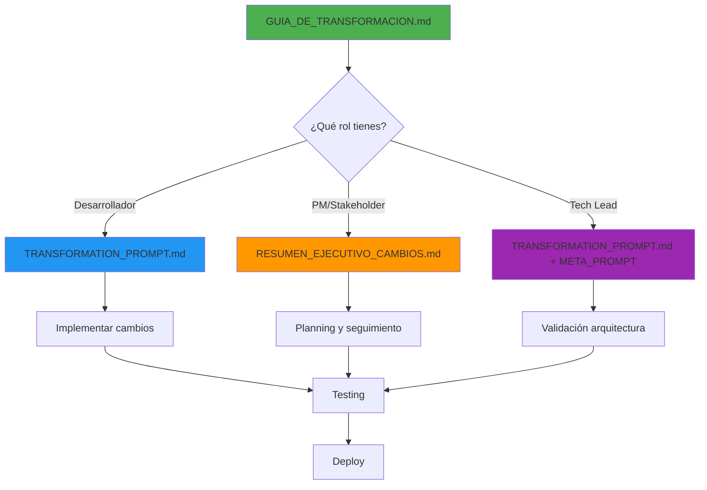

# 🔄 Documentos de Transformación del Proyecto

## ⚡ INICIO RÁPIDO

**¿Primera vez aquí? ¿Tienes solo 3 minutos?**

👉 **Lee primero**: [`INICIO_RAPIDO.md`](./INICIO_RAPIDO.md) - Resumen visual en 3 minutos

**¿Listo para profundizar?**

👉 **Continúa con**: [`GUIA_DE_TRANSFORMACION.md`](./GUIA_DE_TRANSFORMACION.md) - Guía completa

---

## 📚 Índice de Documentos

Este repositorio contiene **5 documentos** para facilitar la transformación completa del proyecto:

| # | Documento | Propósito | Audiencia | Tiempo |
|---|-----------|-----------|-----------|--------|
| **0** | [`INICIO_RAPIDO.md`](./INICIO_RAPIDO.md) | ⚡ Resumen visual ultra-rápido | **Todos - Primera lectura** | 3 min |
| **1** | [`GUIA_DE_TRANSFORMACION.md`](./GUIA_DE_TRANSFORMACION.md) | 📘 Guía maestra - punto de entrada | **Todos** | 15 min |
| **2** | [`TRANSFORMATION_PROMPT.md`](./TRANSFORMATION_PROMPT.md) | 🛠️ Prompt técnico detallado para Cursor AI | **Desarrolladores** | Referencia |
| **3** | [`RESUMEN_EJECUTIVO_CAMBIOS.md`](./RESUMEN_EJECUTIVO_CAMBIOS.md) | 📊 Resumen de alto nivel | **PMs, Stakeholders** | 10 min |
| **4** | [`META_PROMPT_PARA_CHATGPT.md`](./META_PROMPT_PARA_CHATGPT.md) | 🤖 Template reutilizable para futuras transformaciones | **Tech Leads** | 5 min |

---

## 🎯 ¿Cuál documento necesito?

### 👨‍💻 Soy Desarrollador
1. **Primero**: Lee [`GUIA_DE_TRANSFORMACION.md`](./GUIA_DE_TRANSFORMACION.md) - sección "Para el Desarrollador"
2. **Luego**: Usa [`TRANSFORMATION_PROMPT.md`](./TRANSFORMATION_PROMPT.md) como referencia durante desarrollo
3. **Referencia rápida**: [`RESUMEN_EJECUTIVO_CAMBIOS.md`](./RESUMEN_EJECUTIVO_CAMBIOS.md) para ver comparaciones rápidas

### 👔 Soy Project Manager / Stakeholder
1. **Lee**: [`RESUMEN_EJECUTIVO_CAMBIOS.md`](./RESUMEN_EJECUTIVO_CAMBIOS.md) completo
2. **Referencia**: [`GUIA_DE_TRANSFORMACION.md`](./GUIA_DE_TRANSFORMACION.md) - sección "Para el Project Manager"
3. **Opcional**: Revisa timeline en [`TRANSFORMATION_PROMPT.md`](./TRANSFORMATION_PROMPT.md)

### 🏗️ Soy Arquitecto / Tech Lead
1. **Lee todo**: [`TRANSFORMATION_PROMPT.md`](./TRANSFORMATION_PROMPT.md) para entender cambios técnicos profundos
2. **Guarda**: [`META_PROMPT_PARA_CHATGPT.md`](./META_PROMPT_PARA_CHATGPT.md) para proyectos futuros
3. **Valida**: Secciones de arquitectura y base de datos

### 🆕 Soy Nuevo en el Equipo
1. **Comienza**: [`GUIA_DE_TRANSFORMACION.md`](./GUIA_DE_TRANSFORMACION.md)
2. **Entiende el contexto**: [`RESUMEN_EJECUTIVO_CAMBIOS.md`](./RESUMEN_EJECUTIVO_CAMBIOS.md)
3. **Luego**: Según tu rol, ve al documento específico arriba

---

## 🔍 Vista Rápida de Contenido

### 📘 GUIA_DE_TRANSFORMACION.md
```
├─ Propósito y overview
├─ Descripción de los 4 documentos
├─ Guía rápida de implementación
│  ├─ Para desarrolladores (paso a paso)
│  └─ Para project managers (fases)
├─ Checklist pre-implementación
├─ Puntos críticos
├─ Plan de testing
├─ Métricas de éxito
└─ Troubleshooting
```

### 🛠️ TRANSFORMATION_PROMPT.md
```
├─ Contexto del cambio
├─ Tareas de transformación
│  ├─ 1. Actualizar documentación (eliminar/reescribir/actualizar)
│  ├─ 2. Transformar app móvil
│  ├─ 3. Transformar backend
│  ├─ 4. Actualizar dashboard
│  ├─ 5. Migración de base de datos
│  ├─ 6. Actualizar catálogo de productos
│  ├─ 7. Testing del nuevo sistema
│  └─ 8. Documentación final
├─ Nuevos criterios de éxito
├─ Resumen de cambios tecnológicos
├─ Orden de implementación recomendado
└─ Checklist final
```

### 📊 RESUMEN_EJECUTIVO_CAMBIOS.md
```
├─ Objetivo del cambio
├─ Comparación rápida (ANTES vs AHORA)
├─ Cambios fundamentales
├─ Cambios por componente
│  ├─ App móvil
│  ├─ Backend
│  ├─ Base de datos
│  └─ Dashboard
├─ Nuevo flujo operativo
├─ Testing
├─ Costos estimados
├─ Timeline de implementación
├─ Puntos críticos
└─ Checklist de transformación
```

### 🤖 META_PROMPT_PARA_CHATGPT.md
```
├─ Instrucciones de uso
├─ PROMPT PARA CHATGPT (template completo)
├─ Ejemplo de uso
├─ Variaciones del prompt
├─ Tips para mejores resultados
├─ Personalización
├─ FAQ
├─ Ejemplo de iteración
└─ Mantenimiento
```

---

## 📖 Flujo de Lectura Recomendado

### Para implementación completa (Primera vez):



### Para referencia rápida durante desarrollo:

1. **Tengo una pregunta específica**
   - Busca en [`TRANSFORMATION_PROMPT.md`](./TRANSFORMATION_PROMPT.md) la sección relevante
   - Usa Ctrl+F para buscar términos clave

2. **Necesito ver el big picture**
   - Ve a [`RESUMEN_EJECUTIVO_CAMBIOS.md`](./RESUMEN_EJECUTIVO_CAMBIOS.md)
   - Revisa las tablas de comparación

3. **Estoy bloqueado con un problema**
   - Revisa sección "Troubleshooting" en [`GUIA_DE_TRANSFORMACION.md`](./GUIA_DE_TRANSFORMACION.md)
   - Consulta "Puntos Críticos" en [`TRANSFORMATION_PROMPT.md`](./TRANSFORMATION_PROMPT.md)

---

## 🎯 Objetivos de la Transformación

Esta transformación cambia el proyecto de:

### ❌ ANTES
- 3 teléfonos fijos tomando fotos cada 5 segundos
- OpenAI GPT-4 Vision API detectando SKUs
- Validación batch al final del proceso
- Latencia de 6-7 segundos

### ✅ AHORA
- 1 cámara de pecho grabando video continuo en tiempo real
- Google Gemini Robotics-ER 1.5 detectando productos visualmente
- Detección incremental durante el proceso
- Latencia < 2 segundos

**Beneficios**:
- ⚡ Más rápido (detección en tiempo real vs batch)
- 💰 Más económico (Gemini vs OpenAI para este caso)
- 🎯 Más preciso (detección de movimiento + apariencia)
- 👤 Mejor UX (operador solo lleva 1 dispositivo)

---

## ⚙️ Tecnologías Clave Involucradas

### Frontend / Mobile
- React Native + Expo
- expo-camera (modo video)
- Socket.IO client (WebSocket)
- AsyncStorage (buffer local)

### Backend
- Node.js + Express
- Socket.IO (WebSocket server)
- Google Gemini API
- Prisma ORM
- PostgreSQL (Neon)

### Nuevas Dependencias Principales
```json
{
  "mobile": [
    "expo-av": "~13.0.0",
    "socket.io-client": "^4.5.0"
  ],
  "backend": [
    "@google-ai/generativelanguage": "^2.0.0",
    "google-auth-library": "^9.0.0",
    "socket.io": "^4.5.0",
    "fluent-ffmpeg": "^2.1.2"
  ]
}
```

---

## 📊 Impacto Estimado

| Métrica | Antes | Después | Mejora |
|---------|-------|---------|--------|
| **Latencia** | 6-7s | <2s | **70% más rápido** |
| **Dispositivos por trolley** | 3 | 1 | **66% menos hardware** |
| **Costo API por día** | ~$170 | ~$25 | **85% más barato** |
| **Setup time** | 5 min | 30s | **90% más rápido** |
| **Precisión** | 85% | 90%+ | **+5% accuracy** |
| **Trazabilidad** | Batch final | Tiempo real | **100% mejor** |

---

## 🚀 Timeline Esperado

```
┌─────────────────────────────────────────────────────┐
│ TRANSFORMACIÓN COMPLETA: 4-5 días calendario       │
└─────────────────────────────────────────────────────┘

Día 1: Planning + Preparación + DB + Backend (8h)
├─ 09:00-10:00  Planning y setup
├─ 10:00-12:00  Migraciones de DB
├─ 13:00-15:00  Integración Gemini API
└─ 15:00-17:00  WebSocket video streaming

Día 2: Mobile App (8h)
├─ 09:00-11:00  Nuevas screens
├─ 11:00-13:00  Video recording
├─ 14:00-16:00  WebSocket client
└─ 16:00-17:00  Testing básico

Día 3: Dashboard + Integration (8h)
├─ 09:00-11:00  Componentes tiempo real
├─ 11:00-13:00  WebSocket integration
├─ 14:00-16:00  Testing E2E
└─ 16:00-17:00  Bug fixing

Día 4: Testing + Refinamiento (8h)
├─ 09:00-11:00  Testing con productos reales
├─ 11:00-13:00  Ajuste de prompts
├─ 14:00-16:00  Optimizaciones
└─ 16:00-17:00  Documentación

Día 5: Deployment + Handoff (4h)
├─ 09:00-10:00  Deploy staging
├─ 10:00-11:00  Testing final
├─ 11:00-12:00  Deploy producción
└─ 12:00-13:00  Retrospectiva
```

**Total**: 36 horas de trabajo efectivo

---

## ✅ Checklist de Inicio

Antes de comenzar la transformación:

- [ ] He leído [`GUIA_DE_TRANSFORMACION.md`](./GUIA_DE_TRANSFORMACION.md)
- [ ] Tengo acceso a todos los documentos
- [ ] Entiendo el alcance (revisar [`RESUMEN_EJECUTIVO_CAMBIOS.md`](./RESUMEN_EJECUTIVO_CAMBIOS.md))
- [ ] Tengo las credenciales necesarias (Gemini API key)
- [ ] Tengo los dispositivos de prueba
- [ ] El equipo está alineado con el plan
- [ ] He hecho backup del código actual
- [ ] Tengo tiempo bloqueado (4-5 días)

---

## 🆘 ¿Necesitas Ayuda?

### Durante la implementación:
1. **Busca en los documentos** - Usa Ctrl+F
2. **Revisa troubleshooting** - En [`GUIA_DE_TRANSFORMACION.md`](./GUIA_DE_TRANSFORMACION.md)
3. **Consulta ejemplos** - En [`TRANSFORMATION_PROMPT.md`](./TRANSFORMATION_PROMPT.md)

### Problemas técnicos específicos:
- **Gemini API**: Ver sección "Integración con Gemini" en [`TRANSFORMATION_PROMPT.md`](./TRANSFORMATION_PROMPT.md)
- **Video streaming**: Ver sección "Transformar App Móvil"
- **Base de datos**: Ver sección "Migración de Base de Datos"
- **WebSocket**: Ver sección "Transformar Backend"

### Para generar prompts similares en el futuro:
- Usa [`META_PROMPT_PARA_CHATGPT.md`](./META_PROMPT_PARA_CHATGPT.md)

---

## 📝 Mantenimiento de Estos Documentos

Estos documentos deben actualizarse cuando:

- ✏️ Se completa una fase de implementación
- 🐛 Se descubren problemas no documentados
- 💡 Se encuentran mejores soluciones
- 📊 Cambian métricas o estimaciones
- 🔄 Se hacen nuevas transformaciones

**Ubicación sugerida**: 
```
/docs/transformations/
  - 2025-10-25-openai-to-gemini/
    - GUIA_DE_TRANSFORMACION.md
    - TRANSFORMATION_PROMPT.md
    - RESUMEN_EJECUTIVO_CAMBIOS.md
    - META_PROMPT_PARA_CHATGPT.md
    - lessons-learned.md (crear después)
```

---

## 🎓 Lecciones Aprendidas (Actualizar Post-Implementación)

Después de completar la transformación, documenta:

1. **¿Qué funcionó bien?**
2. **¿Qué fue más difícil de lo esperado?**
3. **¿Qué tomarías menos tiempo?**
4. **¿Qué ajustes harías al prompt/guía?**
5. **¿Qué consejo darías al próximo equipo?**

---

## 📄 Licencia y Uso

**Proyecto**: GateGroup Smart Trolley - HackMTY 2025  
**Documentos**: Generados 2025-10-25  
**Versión**: 1.0  
**Uso**: Interno para el equipo del proyecto

Estos documentos pueden ser:
- ✅ Usados libremente dentro del proyecto
- ✅ Modificados según necesidades
- ✅ Compartidos con stakeholders del proyecto
- ✅ Usados como template para proyectos similares

---

## 🔗 Enlaces Rápidos

| Recurso | Link |
|---------|------|
| **Documentación Original** | [`/docs/`](./docs/) |
| **Schema de DB** | [`/prisma/schema.prisma`](./prisma/schema.prisma) |
| **App Móvil** | [`/apps/mobile-shelf/`](./apps/mobile-shelf/) |
| **Backend API** | [`/apps/api/`](./apps/api/) |
| **Dashboard** | [`/apps/dashboard/`](./apps/dashboard/) |
| **Gemini API Docs** | [https://ai.google.dev/gemini-api/docs](https://ai.google.dev/gemini-api/docs) |

---

**¿Listo para comenzar?** 👉 Abre [`GUIA_DE_TRANSFORMACION.md`](./GUIA_DE_TRANSFORMACION.md)

**¡Éxito con la transformación! 🚀**

