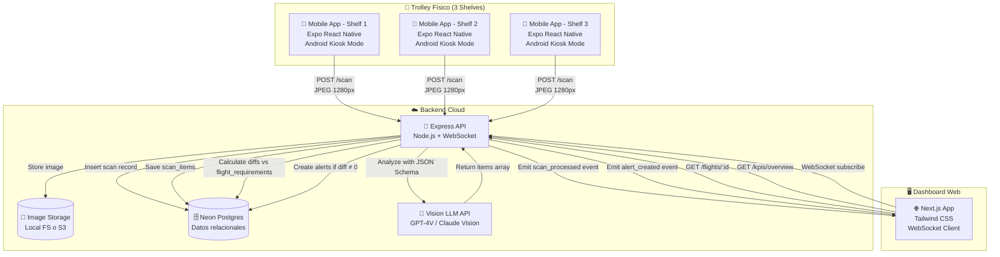
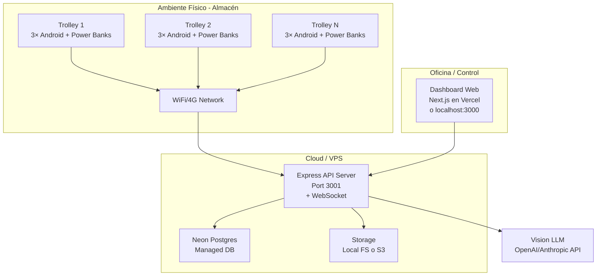
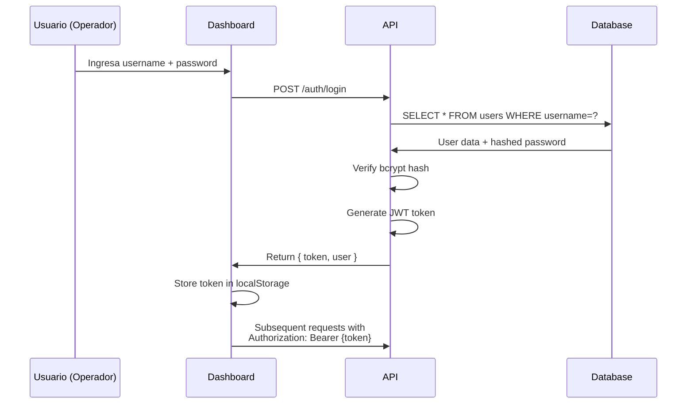

# Arquitectura de Contexto

## Descripción de Alto Nivel

El sistema **Smart Trolley** es una solución de visión por computadora distribuida que captura, analiza y valida el contenido de trolleys de catering aéreo en tiempo real.

### Componentes Principales



## Flujo de Comunicación

### 1. Captura Automática (cada 5 segundos)
- **Actor**: Teléfono Android en modo quiosco
- **Trigger**: Timer de 5 segundos
- **Acción**: Captura foto con cámara trasera
- **Output**: JPEG comprimido (200-400 KB)

### 2. Upload de Imagen
- **Endpoint**: `POST /scan`
- **Content-Type**: `multipart/form-data`
- **Payload**:
  ```json
  {
    "image": <File>,
    "flight_id": 123,
    "trolley_id": 456,
    "shelf_id": 1,
    "captured_by": "user_001"
  }
  ```
- **Retry**: 3 intentos con backoff exponencial
- **Offline**: Almacenar en cola local si falla

### 3. Almacenamiento
- **Ubicación**: `/storage/scans/{flight_id}/{trolley_id}/{timestamp}_{shelf_id}.jpg`
- **Metadata**: Guardar path en tabla `scans` con timestamp
- **Compresión**: JPEG quality 80%, max width 1280px

### 4. Llamada a Vision LLM
- **Modelo**: GPT-4 Vision "mini" o Claude 3 Haiku (más económico)
- **Input**:
  - Imagen en base64 o URL pública
  - Prompt específico con JSON Schema
  - Catálogo de SKUs esperados (few-shot opcional)
- **Output**: JSON estructurado con array de items detectados
- **Timeout**: 15 segundos máximo
- **Fallback**: Si falla, marcar scan con `status=failed` y reintentar después

### 5. Procesamiento de Resultados
- **Parse**: Validar JSON contra schema esperado
- **Insert**: Guardar cada item detectado en `scan_items`
- **Link**: Asociar con el `scan_id` correspondiente

### 6. Cálculo de Diferencias
- **Query**: Obtener `flight_requirements` para `(flight_id, trolley_id)`
- **Compare**: Para cada SKU esperado:
  ```sql
  diff = actual_quantity - expected_quantity
  ```
- **Aggregate**: Sumar diffs por SKU considerando múltiples scans (último scan gana)

### 7. Generación de Alertas
- **Criterios**:
  - `diff > 0` → `excess_item`
  - `diff < 0` → `missing_item`
  - `confidence < 0.60` → `low_confidence`
- **Insert**: Crear registro en tabla `alerts`
- **Severity**:
  - `critical`: Faltantes de items críticos (ej: agua)
  - `warning`: Excedentes menores o confidence media

### 8. Emisión en Tiempo Real
- **Protocolo**: WebSocket
- **Evento 1**: `scan_processed`
  ```json
  {
    "event": "scan_processed",
    "scan_id": 789,
    "trolley_id": 456,
    "shelf_id": 1,
    "items_detected": 5,
    "avg_confidence": 0.87,
    "timestamp": "2025-10-26T10:15:30Z"
  }
  ```
- **Evento 2**: `alert_created`
  ```json
  {
    "event": "alert_created",
    "alert_id": 111,
    "type": "missing_item",
    "severity": "critical",
    "sku": "WTR-REG-500",
    "message": "Faltante: 4 unidades de Agua 500ml",
    "shelf_id": 2
  }
  ```

### 9. Actualización del Dashboard
- **Client**: Dashboard Next.js escuchando en WebSocket
- **Action**: Actualizar UI en tiempo real sin reload
- **Components**:
  - Card de repisa cambia de verde → amarillo → rojo según alertas
  - Contador de items detectados se incrementa
  - Panel de alertas añade nueva alerta al top
  - KPIs recalculan accuracy y confianza media

## Decisiones Clave de Arquitectura

### ✅ Imágenes Cada 5 Segundos (No Video Continuo)

**Contexto**: Necesitamos capturar el contenido de la repisa mientras el operador agrega productos.

**Decisión**: Capturar 1 foto cada 5 segundos en lugar de stream de video.

**Razones**:
- **Menor ancho de banda**: ~400 KB cada 5s vs ~2-5 Mbps de video
- **Procesamiento batch**: Cada imagen se analiza independientemente
- **Menor consumo de batería**: Cámara activa solo 0.5s cada 5s
- **Simplicidad**: No requiere codec ni sincronización de frames
- **Trazabilidad**: Cada imagen es un snapshot auditable

**Trade-offs**:
- Podríamos perder acciones entre intervalos
- Mitigación: 5s es suficiente para que la mano del operador salga del frame

Ver [ADR-0001](decisions-adr-index.md#adr-0001) para detalles.

### ✅ Tres Aplicaciones Android Independientes

**Contexto**: El trolley tiene 3 repisas y necesitamos capturar cada una.

**Decisión**: Usar 3 teléfonos físicos con 3 instancias de la misma app, cada una configurada con diferente `shelf_id`.

**Razones**:
- **Ángulo de cámara óptimo**: Cada teléfono apunta directamente a su repisa
- **Escalabilidad**: Agregar más repisas = agregar más teléfonos
- **Tolerancia a fallos**: Si un teléfono falla, los otros siguen operando
- **Configuración simple**: Escanear QR con `shelf_id` al inicio

**Trade-offs**:
- Más hardware (pero reutilizamos smartphones viejos)
- Sincronización menos precisa entre repisas

Ver [ADR-0002](decisions-adr-index.md#adr-0002).

### ✅ JPEG 1280px con Compresión

**Contexto**: Balance entre calidad de imagen y costos de transferencia/almacenamiento/procesamiento.

**Decisión**: JPEG quality 80%, max width 1280px (height proporcional).

**Razones**:
- **Suficiente resolución**: Detectar logos de productos a 30-40cm
- **Tamaño manejable**: 200-400 KB por imagen
- **Velocidad de upload**: <2s en 4G/WiFi estándar
- **Costo de LLM**: Muchos modelos cobran por píxeles procesados

**Resultado esperado**: ~86,400 imágenes/día = 25-35 GB/día para 1 trolley (3 cámaras × 12 fotos/min × 480 min operación).

Ver [ADR-0003](decisions-adr-index.md#adr-0003).

### ✅ Umbral de Confianza 0.80

**Contexto**: Necesitamos decidir cuándo confiar en las detecciones del modelo.

**Decisión**: 
- **Confianza ≥0.80**: Aceptar automáticamente (verde)
- **Confianza 0.60-0.79**: Advertencia, permitir pero marcar (amarillo)
- **Confianza <0.60**: Alerta crítica, requiere validación manual (rojo)

**Razones**:
- Balance entre automatización y precisión
- Basado en benchmarks de modelos similares (GPT-4V accuracy ~85-90% en objetos comunes)
- Permite intervención humana cuando hay duda

**Trade-off**: Muy estricto (ej: 0.90) generaría demasiadas alertas falsas.

Ver [ADR-0004](decisions-adr-index.md#adr-0004).

### ✅ Cola Offline en el Teléfono

**Contexto**: La conectividad en un almacén puede ser intermitente.

**Decisión**: Implementar cola local con reintentos automáticos.

**Mecanismo**:
1. Intentar enviar imagen inmediatamente
2. Si falla (timeout, error de red), guardar en AsyncStorage con metadata
3. Cada 30s, verificar cola y reintentar envíos pendientes
4. Máximo 50 imágenes en cola (eliminar más antiguas si se llena)

**Ventaja**: El operador no necesita esperar conectividad para seguir trabajando.

Ver [ADR-0005](decisions-adr-index.md#adr-0005).

## Diagrama de Despliegue



### Hosting Sugerido para MVP

| Componente | Opción | Costo Estimado |
|------------|--------|----------------|
| **API Backend** | Render Free Tier o VPS $5/mes | $0-5 |
| **Database** | Neon Postgres Free Tier | $0 |
| **Storage** | Local filesystem (durante hack) | $0 |
| **Dashboard** | Vercel Free Tier | $0 |
| **Vision LLM** | OpenAI API pay-per-use | $0.01-0.10 por imagen |

**Costo total estimado para 36h de hack**: <$50 USD

## Seguridad y Autenticación

### Flujo de Login



### Protección de Endpoints

- **Públicos**: Ninguno
- **Autenticados**: Todos los endpoints requieren JWT válido
- **Scope**: Por ahora todos los usuarios tienen mismo nivel de acceso (simplificación para MVP)

## Escalabilidad y Limitaciones

### Capacidad del MVP

- **Trolleys concurrentes**: 1-3 (limitado por throughput de LLM)
- **Requests/minuto**: ~36 (3 trolleys × 3 shelves × 12 scans/min ÷ 3 throttle)
- **Latencia esperada**: 2-5 segundos desde captura hasta alerta en dashboard
- **Almacenamiento**: 100-200 GB para una semana de operación continua

### Cuellos de Botella Identificados

1. **Rate limit de Vision LLM**: OpenAI limita a ~50-100 req/min en tier gratuito
2. **Upload de imágenes**: Ancho de banda de WiFi en almacén
3. **Procesamiento secuencial**: No hay paralelización de scans en MVP

### Estrategia de Escalamiento (post-MVP)

- **Batch processing**: Agrupar imágenes de mismo shelf en video de 5s
- **Edge processing**: Detección local con modelo TFLite, enviar solo anomalías
- **Queue system**: Redis/RabbitMQ para desacoplar ingesta de procesamiento
- **Horizontal scaling**: Múltiples workers de API detrás de load balancer

---

## Referencias Internas

- [Modelo de Datos](data-model.md) — Esquema de tablas y relaciones
- [Secuencia de Scan](sequence-scan.md) — Flujo detallado paso a paso
- [Contratos de API](../api/contracts.md) — Especificación de endpoints
- [Decisiones ADR](decisions-adr-index.md) — Registro completo de decisiones

