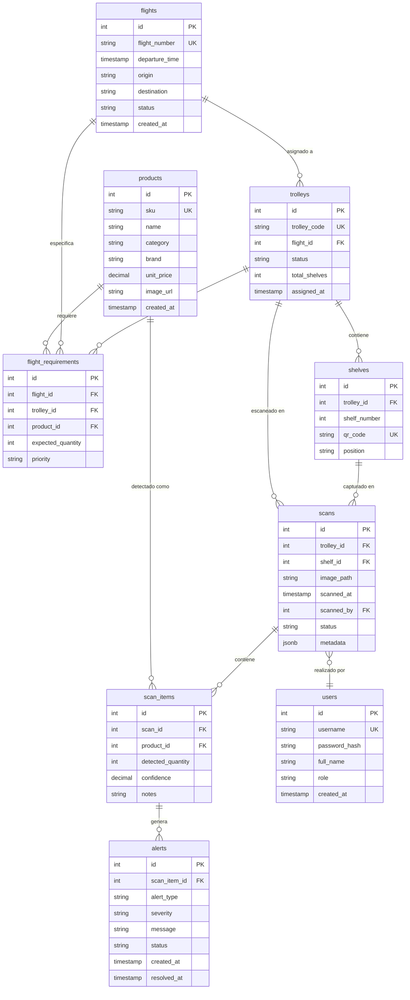

# Modelo de Datos

## Descripción General

El sistema utiliza **PostgreSQL** (Neon serverless) con un modelo relacional normalizado que consta de **9 tablas principales**:

1. `products` — Catálogo de SKUs
2. `flights` — Vuelos programados
3. `trolleys` — Carritos físicos
4. `shelves` — Repisas de los trolleys
5. `flight_requirements` — Qué debe llevar cada trolley
6. `scans` — Registros de capturas de imagen
7. `scan_items` — Items detectados en cada scan
8. `alerts` — Notificaciones de discrepancias
9. `users` — Operadores y usuarios del sistema

## Diagrama Entidad-Relación



## Schema SQL de Referencia

```sql
-- Tabla: products
-- Catálogo de SKUs disponibles
CREATE TABLE products (
    id SERIAL PRIMARY KEY,
    sku VARCHAR(50) UNIQUE NOT NULL,
    name VARCHAR(255) NOT NULL,
    category VARCHAR(100),
    brand VARCHAR(100),
    unit_price DECIMAL(10,2),
    image_url TEXT,
    created_at TIMESTAMP DEFAULT CURRENT_TIMESTAMP
);

-- Tabla: flights
-- Vuelos programados que requieren trolleys
CREATE TABLE flights (
    id SERIAL PRIMARY KEY,
    flight_number VARCHAR(20) UNIQUE NOT NULL,
    departure_time TIMESTAMP NOT NULL,
    origin VARCHAR(10) NOT NULL,
    destination VARCHAR(10) NOT NULL,
    status VARCHAR(20) DEFAULT 'scheduled',
    created_at TIMESTAMP DEFAULT CURRENT_TIMESTAMP
);

-- Tabla: trolleys
-- Carritos físicos asignados a vuelos
CREATE TABLE trolleys (
    id SERIAL PRIMARY KEY,
    trolley_code VARCHAR(50) UNIQUE NOT NULL,
    flight_id INTEGER REFERENCES flights(id),
    status VARCHAR(20) DEFAULT 'empty',
    total_shelves INTEGER DEFAULT 3,
    assigned_at TIMESTAMP
);

-- Tabla: shelves
-- Repisas dentro de cada trolley
CREATE TABLE shelves (
    id SERIAL PRIMARY KEY,
    trolley_id INTEGER REFERENCES trolleys(id) ON DELETE CASCADE,
    shelf_number INTEGER NOT NULL,
    qr_code VARCHAR(100) UNIQUE,
    position VARCHAR(20),
    CONSTRAINT unique_shelf_per_trolley UNIQUE (trolley_id, shelf_number)
);

-- Tabla: flight_requirements
-- Especificación de qué productos y cantidades debe llevar cada trolley
CREATE TABLE flight_requirements (
    id SERIAL PRIMARY KEY,
    flight_id INTEGER REFERENCES flights(id),
    trolley_id INTEGER REFERENCES trolleys(id),
    product_id INTEGER REFERENCES products(id),
    expected_quantity INTEGER NOT NULL,
    priority VARCHAR(20) DEFAULT 'normal',
    CONSTRAINT unique_requirement UNIQUE (flight_id, trolley_id, product_id)
);

-- Tabla: scans
-- Registros de cada captura de imagen
CREATE TABLE scans (
    id SERIAL PRIMARY KEY,
    trolley_id INTEGER REFERENCES trolleys(id),
    shelf_id INTEGER REFERENCES shelves(id),
    image_path TEXT NOT NULL,
    scanned_at TIMESTAMP DEFAULT CURRENT_TIMESTAMP,
    scanned_by INTEGER REFERENCES users(id),
    status VARCHAR(20) DEFAULT 'processing',
    metadata JSONB
);

-- Tabla: scan_items
-- Items detectados por el Vision LLM en cada scan
CREATE TABLE scan_items (
    id SERIAL PRIMARY KEY,
    scan_id INTEGER REFERENCES scans(id) ON DELETE CASCADE,
    product_id INTEGER REFERENCES products(id),
    detected_quantity INTEGER NOT NULL,
    confidence DECIMAL(5,4) NOT NULL,
    notes TEXT
);

-- Tabla: alerts
-- Notificaciones generadas por discrepancias o baja confianza
CREATE TABLE alerts (
    id SERIAL PRIMARY KEY,
    scan_item_id INTEGER REFERENCES scan_items(id),
    alert_type VARCHAR(50) NOT NULL,
    severity VARCHAR(20) DEFAULT 'warning',
    message TEXT NOT NULL,
    status VARCHAR(20) DEFAULT 'active',
    created_at TIMESTAMP DEFAULT CURRENT_TIMESTAMP,
    resolved_at TIMESTAMP
);

-- Tabla: users
-- Operadores y usuarios del sistema
CREATE TABLE users (
    id SERIAL PRIMARY KEY,
    username VARCHAR(50) UNIQUE NOT NULL,
    password_hash TEXT NOT NULL,
    full_name VARCHAR(255),
    role VARCHAR(20) DEFAULT 'operator',
    created_at TIMESTAMP DEFAULT CURRENT_TIMESTAMP
);

-- Índices para optimización de queries
CREATE INDEX idx_scans_trolley ON scans(trolley_id);
CREATE INDEX idx_scans_shelf ON scans(shelf_id);
CREATE INDEX idx_scans_timestamp ON scans(scanned_at DESC);
CREATE INDEX idx_scan_items_scan ON scan_items(scan_id);
CREATE INDEX idx_scan_items_product ON scan_items(product_id);
CREATE INDEX idx_alerts_status ON alerts(status) WHERE status = 'active';
CREATE INDEX idx_flight_reqs_trolley ON flight_requirements(trolley_id);
```

## Descripción Detallada de Tablas

### 1. `products`
Catálogo maestro de todos los productos (SKUs) disponibles en el sistema.

| Campo | Tipo | Descripción |
|-------|------|-------------|
| `id` | SERIAL | Identificador único |
| `sku` | VARCHAR(50) | Código SKU único (ej: `COK-REG-330`) |
| `name` | VARCHAR(255) | Nombre comercial del producto |
| `category` | VARCHAR(100) | Categoría (bebidas, snacks, comidas, etc.) |
| `brand` | VARCHAR(100) | Marca comercial |
| `unit_price` | DECIMAL(10,2) | Precio unitario (opcional para MVP) |
| `image_url` | TEXT | URL de imagen de referencia para few-shot |
| `created_at` | TIMESTAMP | Fecha de creación del registro |

**Ejemplo de datos**:
```sql
INSERT INTO products (sku, name, category, brand, unit_price) VALUES
('COK-REG-330', 'Coca-Cola Regular 330ml', 'Bebidas', 'Coca-Cola', 1.50),
('WTR-REG-500', 'Agua Natural 500ml', 'Bebidas', 'Bonafont', 0.80),
('SNK-PRT-50', 'Pretzels Salados 50g', 'Snacks', 'Snyder''s', 2.00);
```

### 2. `flights`
Vuelos programados que requieren preparación de trolleys.

| Campo | Tipo | Descripción |
|-------|------|-------------|
| `id` | SERIAL | Identificador único |
| `flight_number` | VARCHAR(20) | Número de vuelo (ej: `AA2345`) |
| `departure_time` | TIMESTAMP | Hora programada de salida |
| `origin` | VARCHAR(10) | Código IATA de origen |
| `destination` | VARCHAR(10) | Código IATA de destino |
| `status` | VARCHAR(20) | Estado: `scheduled`, `boarding`, `departed`, `cancelled` |
| `created_at` | TIMESTAMP | Fecha de creación |

**Ejemplo de datos**:
```sql
INSERT INTO flights (flight_number, departure_time, origin, destination, status) VALUES
('AA2345', '2025-10-26 14:30:00', 'MEX', 'JFK', 'scheduled'),
('AM0876', '2025-10-26 16:45:00', 'MEX', 'MAD', 'scheduled');
```

### 3. `trolleys`
Carritos físicos que se asignan a vuelos específicos.

| Campo | Tipo | Descripción |
|-------|------|-------------|
| `id` | SERIAL | Identificador único |
| `trolley_code` | VARCHAR(50) | Código del trolley físico (ej: `TRLLY-001`) |
| `flight_id` | INTEGER | Vuelo al que está asignado |
| `status` | VARCHAR(20) | `empty`, `in_progress`, `ready`, `dispatched` |
| `total_shelves` | INTEGER | Número de repisas (típicamente 3) |
| `assigned_at` | TIMESTAMP | Cuándo se asignó al vuelo |

**Ejemplo de datos**:
```sql
INSERT INTO trolleys (trolley_code, flight_id, status, total_shelves, assigned_at) VALUES
('TRLLY-001', 1, 'in_progress', 3, '2025-10-26 10:00:00');
```

### 4. `shelves`
Repisas individuales dentro de cada trolley.

| Campo | Tipo | Descripción |
|-------|------|-------------|
| `id` | SERIAL | Identificador único |
| `trolley_id` | INTEGER | Trolley al que pertenece |
| `shelf_number` | INTEGER | Número de repisa (1=top, 2=mid, 3=bot) |
| `qr_code` | VARCHAR(100) | Código QR impreso para identificación |
| `position` | VARCHAR(20) | Posición: `top`, `middle`, `bottom` |

**Ejemplo de datos**:
```sql
INSERT INTO shelves (trolley_id, shelf_number, qr_code, position) VALUES
(1, 1, 'QR-TRLLY001-SH1', 'top'),
(1, 2, 'QR-TRLLY001-SH2', 'middle'),
(1, 3, 'QR-TRLLY001-SH3', 'bottom');
```

### 5. `flight_requirements`
Especificación de productos y cantidades esperadas por trolley.

| Campo | Tipo | Descripción |
|-------|------|-------------|
| `id` | SERIAL | Identificador único |
| `flight_id` | INTEGER | Vuelo al que aplica |
| `trolley_id` | INTEGER | Trolley específico |
| `product_id` | INTEGER | Producto (SKU) requerido |
| `expected_quantity` | INTEGER | Cantidad esperada |
| `priority` | VARCHAR(20) | `critical`, `normal`, `optional` |

**Ejemplo de datos**:
```sql
INSERT INTO flight_requirements (flight_id, trolley_id, product_id, expected_quantity, priority) VALUES
(1, 1, 1, 24, 'normal'),    -- 24 Coca-Colas
(1, 1, 2, 30, 'critical'),  -- 30 Aguas (crítico)
(1, 1, 3, 12, 'normal');    -- 12 Pretzels
```

### 6. `scans`
Registros de cada captura de imagen realizada.

| Campo | Tipo | Descripción |
|-------|------|-------------|
| `id` | SERIAL | Identificador único |
| `trolley_id` | INTEGER | Trolley escaneado |
| `shelf_id` | INTEGER | Repisa específica |
| `image_path` | TEXT | Ruta del archivo de imagen almacenado |
| `scanned_at` | TIMESTAMP | Timestamp de captura |
| `scanned_by` | INTEGER | Usuario que inició el proceso |
| `status` | VARCHAR(20) | `processing`, `completed`, `failed` |
| `metadata` | JSONB | Datos adicionales (dimensiones, formato, etc.) |

**Ejemplo de datos**:
```sql
INSERT INTO scans (trolley_id, shelf_id, image_path, scanned_by, status, metadata) VALUES
(1, 1, '/storage/scans/1/1/2025-10-26_10-15-30_1.jpg', 1, 'completed', 
 '{"size_kb": 342, "resolution": "1280x960", "format": "jpeg"}');
```

### 7. `scan_items`
Items detectados por el Vision LLM en cada scan.

| Campo | Tipo | Descripción |
|-------|------|-------------|
| `id` | SERIAL | Identificador único |
| `scan_id` | INTEGER | Scan al que pertenece |
| `product_id` | INTEGER | Producto detectado |
| `detected_quantity` | INTEGER | Cantidad detectada |
| `confidence` | DECIMAL(5,4) | Score de confianza (0.0000 - 1.0000) |
| `notes` | TEXT | Notas del modelo (ej: "parcialmente visible") |

**Ejemplo de datos**:
```sql
INSERT INTO scan_items (scan_id, product_id, detected_quantity, confidence, notes) VALUES
(1, 1, 23, 0.8750, NULL),
(1, 2, 30, 0.9200, NULL),
(1, 3, 11, 0.7500, 'Una unidad parcialmente oculta');
```

### 8. `alerts`
Notificaciones generadas por discrepancias o problemas.

| Campo | Tipo | Descripción |
|-------|------|-------------|
| `id` | SERIAL | Identificador único |
| `scan_item_id` | INTEGER | Scan item que generó la alerta |
| `alert_type` | VARCHAR(50) | `missing_item`, `excess_item`, `quantity_mismatch`, `low_confidence` |
| `severity` | VARCHAR(20) | `critical`, `warning`, `info` |
| `message` | TEXT | Mensaje descriptivo para el usuario |
| `status` | VARCHAR(20) | `active`, `acknowledged`, `resolved` |
| `created_at` | TIMESTAMP | Cuándo se creó |
| `resolved_at` | TIMESTAMP | Cuándo se resolvió (NULL si activa) |

**Ejemplo de datos**:
```sql
INSERT INTO alerts (scan_item_id, alert_type, severity, message, status) VALUES
(3, 'quantity_mismatch', 'warning', 
 'Pretzels: esperados 12, detectados 11 (diff: -1)', 'active');
```

### 9. `users`
Operadores y usuarios del sistema.

| Campo | Tipo | Descripción |
|-------|------|-------------|
| `id` | SERIAL | Identificador único |
| `username` | VARCHAR(50) | Nombre de usuario para login |
| `password_hash` | TEXT | Hash bcrypt de la contraseña |
| `full_name` | VARCHAR(255) | Nombre completo |
| `role` | VARCHAR(20) | `admin`, `operator`, `viewer` |
| `created_at` | TIMESTAMP | Fecha de creación |

**Ejemplo de datos**:
```sql
INSERT INTO users (username, password_hash, full_name, role) VALUES
('operator01', '$2b$10$...', 'Juan Pérez', 'operator'),
('admin', '$2b$10$...', 'Admin Sistema', 'admin');
```

## Relaciones Clave

### `flights` ← `trolleys` ← `scans`
Trazabilidad completa desde vuelo hasta cada imagen capturada.

### `flight_requirements` ↔ `scan_items`
Comparación para calcular `diff`:
```sql
SELECT 
    fr.product_id,
    p.sku,
    fr.expected_quantity,
    COALESCE(SUM(si.detected_quantity), 0) as actual_quantity,
    COALESCE(SUM(si.detected_quantity), 0) - fr.expected_quantity as diff
FROM flight_requirements fr
LEFT JOIN scan_items si ON si.product_id = fr.product_id
LEFT JOIN scans s ON s.id = si.scan_id AND s.trolley_id = fr.trolley_id
LEFT JOIN products p ON p.id = fr.product_id
WHERE fr.trolley_id = 1 AND fr.flight_id = 1
GROUP BY fr.product_id, p.sku, fr.expected_quantity;
```

### `scan_items` → `alerts`
Generación automática de alertas cuando diff ≠ 0 o confidence < 0.60.

## Queries Frecuentes

### 1. Obtener estado actual de un trolley
```sql
SELECT 
    t.trolley_code,
    f.flight_number,
    t.status,
    COUNT(DISTINCT s.id) as total_scans,
    MAX(s.scanned_at) as last_scan
FROM trolleys t
JOIN flights f ON f.id = t.flight_id
LEFT JOIN scans s ON s.trolley_id = t.id
WHERE t.id = 1
GROUP BY t.trolley_code, f.flight_number, t.status;
```

### 2. Alertas activas por trolley
```sql
SELECT 
    a.severity,
    a.alert_type,
    a.message,
    a.created_at,
    sh.position as shelf_position
FROM alerts a
JOIN scan_items si ON si.id = a.scan_item_id
JOIN scans s ON s.id = si.scan_id
JOIN shelves sh ON sh.id = s.shelf_id
WHERE s.trolley_id = 1 AND a.status = 'active'
ORDER BY a.severity DESC, a.created_at DESC;
```

### 3. KPI: Exactitud por repisa
```sql
SELECT 
    sh.position,
    COUNT(DISTINCT s.id) as total_scans,
    AVG(si.confidence) as avg_confidence,
    COUNT(CASE WHEN a.id IS NOT NULL THEN 1 END) as alerts_generated
FROM shelves sh
JOIN scans s ON s.shelf_id = sh.id
JOIN scan_items si ON si.scan_id = s.id
LEFT JOIN alerts a ON a.scan_item_id = si.id AND a.status = 'active'
WHERE sh.trolley_id = 1
GROUP BY sh.position;
```

---

## Referencias

- [Arquitectura de Contexto](context-architecture.md) — Cómo interactúan estos datos
- [Contratos de API](../api/contracts.md) — Endpoints que consumen estas tablas
- [KPIs y Métricas](../kpis/kpis-metrics.md) — Queries para dashboards

