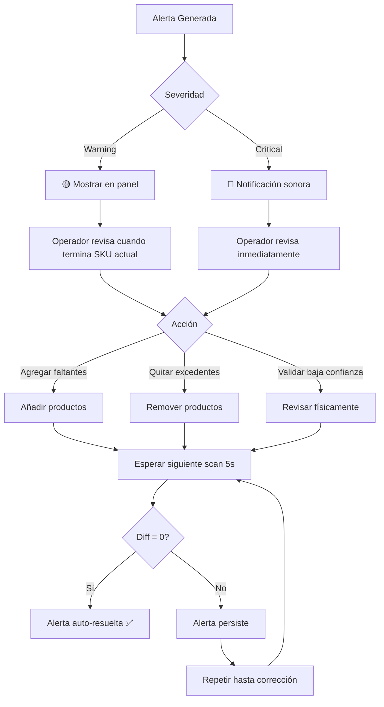

# Flujo Operativo

Este documento describe el flujo de trabajo operativo completo desde la perspectiva del operador de Pick & Pack.

## Flujo General (6 Pasos)

### Paso 1: Preparación del Trolley

**Actor**: Operador de almacén  
**Duración**: 2-3 minutos  
**Herramientas**: Trolley físico, 3 teléfonos Android montados, power banks

**Acciones**:
1. Seleccionar trolley del pool disponible
2. Verificar que los 3 teléfonos estén montados correctamente:
   - Top shelf (repisa superior)
   - Middle shelf (repisa media)
   - Bottom shelf (repisa inferior)
3. Conectar power banks a los teléfonos (si no lo están)
4. Encender cada teléfono (modo quiosco se activa automáticamente)
5. Verificar indicador visual: "Sistema listo - Verde ✅" en cada pantalla

**Verificación**:
- Luz LED de cada teléfono debe estar encendida
- Cada app debe mostrar "Conectado al backend"
- QR code de cada shelf debe estar visible

---

### Paso 2: Asignación del Vuelo

**Actor**: Supervisor o sistema automático  
**Duración**: 1 minuto  
**Herramientas**: Dashboard web

**Acciones**:
1. Desde el dashboard, supervisor selecciona vuelo próximo:
   - `Flight AA2345` → Salida: 14:30 → Destino: JFK
2. Asignar trolley `TRLLY-001` al vuelo
3. Sistema carga automáticamente `flight_requirements` en los teléfonos
4. Cada teléfono muestra resumen:
   ```
   Vuelo: AA2345
   Trolley: TRLLY-001
   Shelf: Top (1/3)
   
   Requisitos cargados: 12 SKUs
   Status: Listo para comenzar
   ```

**Alternativa manual**:
- Operador escanea QR del trolley con un teléfono
- QR contiene: `{"trolley_id": 1, "flight_id": 123}`
- Sistema carga requisitos automáticamente

---

### Paso 3: Picking de Productos

**Actor**: Operador de almacén  
**Duración**: 6-10 minutos (dependiendo de cantidad de SKUs)  
**Herramientas**: Lista impresa o tablet con requisitos (opcional)

**Acciones**:
1. Empujar el trolley hacia la zona de picking
2. Comenzar a agregar productos según requisitos:
   - **Top shelf**: Bebidas frías (Coca-Cola, Pepsi, Agua)
   - **Middle shelf**: Snacks empacados (Pretzels, Chips, Nueces)
   - **Bottom shelf**: Comidas preparadas, utensilios
3. Sistema captura foto cada 5 segundos automáticamente
4. Operador NO interactúa con los teléfonos (trabajo hands-free)

**Feedback en tiempo real**:
- Dashboard muestra scans en vivo
- Supervisor puede ver progreso sin estar físicamente presente
- Si hay alerta, aparece notificación en dashboard

**Ejemplo de secuencia**:
```
00:00 - Operador agrega 12 latas de Coca-Cola a top shelf
00:05 - Teléfono 1 captura imagen → Backend detecta "12× COK-REG-330"
00:10 - Dashboard actualiza: "Top shelf: 12/24 Coca-Colas detectadas"
00:15 - Operador agrega 12 latas más
00:20 - Teléfono 1 captura → Backend detecta "24× COK-REG-330"
00:25 - Dashboard: "Top shelf: ✅ COK-REG-330 completo (24/24)"
```

---

### Paso 4: Detección de Discrepancias en Tiempo Real

**Actor**: Sistema automático + Dashboard  
**Duración**: Continuo (durante Paso 3)  
**Herramientas**: Dashboard web con alertas

**Escenario A: Producto Faltante**
```
Requisito: 24× COK-REG-330
Detectado: 23× COK-REG-330
Diff: -1

→ Sistema genera alerta:
   "⚠️ Top Shelf: Faltante 1 Coca-Cola Regular (23/24)"
   
→ Dashboard muestra:
   Top Shelf: 🟡 Amarillo (advertencia)
```

**Escenario B: Producto Excedente**
```
Requisito: 24× COK-REG-330
Detectado: 26× COK-REG-330
Diff: +2

→ Sistema genera alerta:
   "⚠️ Top Shelf: Excedente de 2 Coca-Colas (26/24)"
   
→ Dashboard muestra:
   Top Shelf: 🟡 Amarillo (advertencia)
```

**Escenario C: Baja Confianza**
```
Detectado: 11× SNK-PRT-50
Confidence: 0.58

→ Sistema genera alerta crítica:
   "🔴 Middle Shelf: Detección de Pretzels con baja confianza (0.58). Revisar manualmente."
   
→ Dashboard muestra:
   Middle Shelf: 🔴 Rojo (crítico)
```

**Acción del operador**:
1. Revisar notificación en tablet/monitor del supervisor
2. Ajustar productos según indicación
3. Esperar siguiente scan (5s) para confirmar corrección

---

### Paso 5: Validación Final

**Actor**: Operador + Sistema  
**Duración**: 1-2 minutos  
**Herramientas**: Dashboard web

**Acciones**:
1. Operador indica que terminó el picking (presiona botón en tablet o dashboard)
2. Sistema realiza scan final forzado (inmediato, no espera los 5s)
3. Dashboard muestra resumen consolidado:

```
┌─────────────────────────────────────────┐
│ Trolley TRLLY-001 - Vuelo AA2345        │
│ Status: Validación Final                │
├─────────────────────────────────────────┤
│ 🟢 Top Shelf       │ ✅ 100% Completo   │
│ 🟢 Middle Shelf    │ ✅ 100% Completo   │
│ 🟢 Bottom Shelf    │ ✅ 100% Completo   │
├─────────────────────────────────────────┤
│ Accuracy:          │ 100%               │
│ Avg Confidence:    │ 0.89               │
│ Alertas activas:   │ 0                  │
│ Tiempo total:      │ 7m 32s             │
└─────────────────────────────────────────┘

          ✅ TROLLEY APROBADO
       Listo para despacho
```

**Decisión**:
- **Si todo verde (🟢)**: Proceder a Paso 6 (Despacho)
- **Si algún amarillo (🟡) o rojo (🔴)**: Revisar alertas pendientes antes de continuar

---

### Paso 6: Despacho

**Actor**: Operador de despacho  
**Duración**: 1 minuto  
**Herramientas**: Etiqueta de vuelo, sistema de cierre

**Acciones**:
1. Supervisor marca trolley como "Ready for dispatch" en dashboard
2. Operador de despacho coloca etiqueta del vuelo en trolley
3. Trolley se traslada a zona de carga del avión
4. Sistema guarda registro completo:
   - Total de scans realizados
   - Imágenes capturadas (almacenadas para auditoría)
   - Alertas generadas y resueltas
   - Tiempo total de preparación
   - Accuracy final

**Estado final en DB**:
```sql
UPDATE trolleys 
SET status = 'dispatched', 
    dispatched_at = NOW() 
WHERE id = 456;
```

---

## Estados de Repisa (Semáforo)

Cada repisa puede estar en uno de tres estados visuales en el dashboard:

| Estado | Color | Criterio | Acción Requerida |
|--------|-------|----------|------------------|
| **Completo** | 🟢 Verde | Todos los items con diff=0 y confidence≥0.80 | Ninguna |
| **Advertencia** | 🟡 Amarillo | Diffs menores (±1-2 unidades) o confidence 0.60-0.79 | Revisar cuando sea posible |
| **Crítico** | 🔴 Rojo | Faltantes críticos, excedentes grandes, o confidence<0.60 | Revisar inmediatamente |

### Ejemplo Visual en Dashboard

```
┌─────────────────────────────────────────────────┐
│  Shelf 1 (Top)                       🟢 Verde   │
│  Última actualización: 10:15:34                 │
│  Confianza promedio: 0.92                       │
│  Items detectados: 54/54                        │
│  Alertas: 0                                     │
└─────────────────────────────────────────────────┘

┌─────────────────────────────────────────────────┐
│  Shelf 2 (Middle)                    🟡 Amarillo│
│  Última actualización: 10:15:32                 │
│  Confianza promedio: 0.76                       │
│  Items detectados: 29/30                        │
│  Alertas: 1 - "Faltante 1 Pretzel"              │
└─────────────────────────────────────────────────┘

┌─────────────────────────────────────────────────┐
│  Shelf 3 (Bottom)                    🔴 Rojo    │
│  Última actualización: 10:15:28                 │
│  Confianza promedio: 0.55                       │
│  Items detectados: 12/20                        │
│  Alertas: 3 - Ver detalles                      │
└─────────────────────────────────────────────────┘
```

---

## Flujo de Resolución de Alertas



---

## Métricas Operativas Clave

### Tiempo por Trolley

**Objetivo**: <8 minutos promedio

| Fase | Tiempo Esperado |
|------|-----------------|
| Preparación | 2-3 min |
| Asignación | 1 min |
| Picking | 4-6 min |
| Validación | 1 min |
| Despacho | 1 min |
| **TOTAL** | **7-9 min** |

### Exactitud por Turno

**Objetivo**: ≥90% de trolleys sin errores

```
Fórmula: (Trolleys perfectos / Trolleys totales) × 100

Ejemplo:
- Trolleys procesados: 20
- Trolleys con 0 alertas finales: 18
- Accuracy: 18/20 = 90%
```

### Tasa de Corrección

**Objetivo**: ≥95% de alertas resueltas antes de despacho

```
Fórmula: (Alertas resueltas / Alertas generadas) × 100

Ejemplo:
- Alertas generadas: 8
- Alertas resueltas: 7
- Tasa de corrección: 7/8 = 87.5%
```

---

## Casos de Uso Especiales

### Caso 1: Pérdida de Conectividad

**Escenario**: El teléfono pierde WiFi/4G durante el picking.

**Comportamiento**:
1. App guarda scans en cola local (AsyncStorage)
2. Indicador en pantalla: "⚠️ Offline - 3 scans pendientes"
3. Al recuperar conexión, envía scans automáticamente
4. Dashboard recibe scans con delay, pero los procesa normalmente

**Impacto**: Ninguno si la conexión se recupera antes del despacho.

---

### Caso 2: Batería Baja en Teléfono

**Escenario**: Power bank se desconecta o batería <10%.

**Comportamiento**:
1. Teléfono muestra alerta: "🔋 Batería baja - Conectar cargador"
2. Si batería llega a 5%, sistema guarda estado y apaga app
3. Dashboard muestra: "⚠️ Shelf 2 - Sin señal hace 2 minutos"

**Mitigación**:
- Operador puede continuar con los otros 2 teléfonos
- Supervisor puede inferir contenido de shelf inactivo basado en requisitos

---

### Caso 3: Producto No Está en Catálogo

**Escenario**: Vision LLM detecta un SKU que no existe en la DB.

**Comportamiento**:
1. Backend recibe SKU `SNK-NEW-100` del LLM
2. Query a DB retorna 0 resultados
3. Backend registra en logs: "Unknown SKU detected: SNK-NEW-100"
4. NO inserta en `scan_items`
5. Dashboard NO muestra ese item

**Solución**:
- Supervisor añade el nuevo SKU al catálogo manualmente
- Re-procesar scan (botón "Reanalizar" en dashboard)

---

### Caso 4: Múltiples Trolleys Simultáneos

**Escenario**: 3 operadores trabajando en paralelo.

**Comportamiento**:
1. Dashboard muestra tabs para cada trolley:
   ```
   [TRLLY-001 - AA2345]  [TRLLY-002 - AM0876]  [TRLLY-003 - DL1234]
   ```
2. Cada tab tiene su propio estado de repisas y alertas
3. WebSocket emite eventos con `trolley_id` para filtrar

**Escalabilidad**: Sistema puede manejar hasta 10 trolleys concurrentes (limitado por rate limit de Vision LLM).

---

## Checklist de Inicio de Turno

- [ ] Verificar que todos los trolleys tienen teléfonos montados
- [ ] Power banks cargados al 100%
- [ ] Iluminación LED funcionando en cada trolley
- [ ] Dashboard web accesible y mostrando conexión activa
- [ ] Backend y DB operativos (verificar endpoint `/health`)
- [ ] Catálogo de SKUs actualizado con productos del día
- [ ] Supervisores logueados en dashboard

## Checklist de Fin de Turno

- [ ] Marcar todos los trolleys como `dispatched` o `cancelled`
- [ ] Descargar reporte de KPIs del turno
- [ ] Apagar teléfonos y conectar a cargadores
- [ ] Limpiar cola offline de cada teléfono (si aplica)
- [ ] Archivar imágenes del día (backup a storage externo)

---

## Referencias

- [Flujo Técnico de Scan](technical-scan.md) — Detalles técnicos del proceso
- [Script de Demostración](../demo/demo-script.md) — Ejemplo de demo para jueces
- [KPIs y Métricas](../kpis/kpis-metrics.md) — Definiciones de métricas operativas

