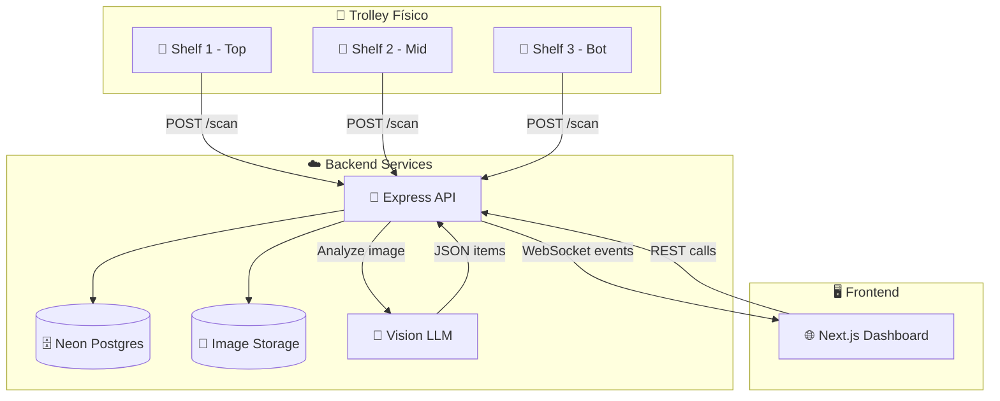

# Visión General del Proyecto

## Contexto del Reto HackMTY x GateGroup

**GateGroup** es uno de los líderes mundiales en servicios de catering aéreo, atendiendo millones de pasajeros diariamente. Uno de sus desafíos operativos más críticos es el proceso de **Pick & Pack** para trolleys de vuelos comerciales.

### El Desafío Actual

Cada vuelo requiere trolleys preparados con productos específicos (bebidas, snacks, comidas, utensilios) según:
- Duración del vuelo
- Clase de servicio
- Número de pasajeros
- Restricciones dietéticas
- Regulaciones del país de destino

**Problemas identificados:**
1. **Proceso manual**: Operadores recorren almacenes seleccionando items uno por uno
2. **Errores frecuentes**: Productos faltantes, excedentes o incorrectos
3. **Presión de tiempo**: Ventanas de 30-90 minutos para preparar múltiples vuelos
4. **Falta de visibilidad**: No se detectan errores hasta que el avión despega
5. **Costos de corrección**: Imposible corregir errores en vuelo
6. **Desperdicio**: Productos excedentes pueden no reutilizarse

### La Oportunidad

**HackMTY 2025** presenta la oportunidad de aplicar tecnología emergente (visión por computadora multimodal) a un problema real de operaciones logísticas de alta velocidad.

## Beneficios Esperados del MVP

### Métricas Clave
| Métrica | Estado Actual | Objetivo MVP | Impacto |
|---------|---------------|--------------|---------|
| **Exactitud de picks** | ~85% | >90% | -50% errores |
| **Tiempo por trolley** | 8-12 min | 6-8 min | +25% eficiencia |
| **Trazabilidad** | Manual/nula | 100% automática | Auditoría completa |
| **Detección de errores** | Post-vuelo | Tiempo real | Corrección inmediata |
| **Confianza operativa** | Inspección visual | Score ML >0.80 | Decisiones data-driven |

### Beneficios Operativos

1. **Reducción de errores**: Detección automática de faltantes/excedentes antes de despacho
2. **Velocidad**: Feedback en tiempo real permite correcciones inmediatas
3. **Trazabilidad**: Cada scan queda registrado con timestamp, usuario, confianza
4. **Entrenamiento**: Nuevos operadores pueden validar su trabajo en vivo
5. **Analítica**: KPIs históricos para optimizar catálogos y procesos
6. **Sostenibilidad**: Menos desperdicio por errores de sobreproducción

### Beneficios Técnicos

- **Escalabilidad**: Modelo extensible a decenas de estaciones en paralelo
- **Flexibilidad**: Catálogo de productos actualizable vía base de datos
- **Integración**: API REST estándar para conectar con ERP/WMS existente
- **Costo-efectividad**: Reutilizar hardware (smartphones Android retirados)
- **Actualizable**: Mejora continua del modelo con datos reales

## Alcance del MVP

### ✅ Lo que SÍ incluye el MVP

1. **Captura automática de imágenes**
   - 3 teléfonos Android fijos (uno por repisa)
   - Foto cada 5 segundos durante el proceso de picking
   - Compresión automática a JPEG 1280px

2. **Detección de SKUs con Visión LLM**
   - Identificación de productos por apariencia visual
   - Conteo de cantidades por SKU
   - Score de confianza por item detectado

3. **Comparación contra requisitos**
   - Carga de `flight_requirements` desde base de datos
   - Cálculo automático de diferencias (expected vs actual)
   - Clasificación de discrepancias (faltante/excedente)

4. **Alertas en tiempo real**
   - Notificaciones cuando diff ≠ 0
   - Clasificación por severidad (crítico/advertencia)
   - Emisión vía WebSocket al dashboard

5. **Dashboard web con KPIs**
   - Vista de trolley en progreso
   - Métricas de exactitud por repisa
   - Historial de scans
   - Panel de alertas activas

6. **Base de datos relacional**
   - Modelo normalizado con 9 tablas
   - Histórico de scans y alertas
   - Auditoría de usuarios y acciones

### ❌ Lo que NO incluye el MVP (fuera de alcance)

1. **Integración con sistemas legacy**
   - No se conecta a ERP/WMS/SAP existentes
   - No consume APIs de GateGroup en producción

2. **Autenticación empresarial**
   - No SSO/LDAP/Active Directory
   - JWT simple sin renovación automática

3. **Procesamiento de video en vivo**
   - Solo imágenes estáticas, no streaming

4. **Detección de daños o calidad**
   - Solo identifica SKU y cantidad, no estado del producto

5. **Optimización de rutas de picking**
   - No sugiere orden óptimo de recolección

6. **Impresión de etiquetas o packing slips**
   - Solo dashboard digital

7. **Gestión de inventario completo**
   - No controla stock de almacén, solo valida trolley

8. **Multi-tenancy o multi-sede**
   - Diseñado para una operación/sede

9. **Aplicación móvil para operadores**
   - Solo dashboard web, no app nativa para supervisores

10. **Alta disponibilidad / disaster recovery**
    - Configuración simple para demo, no producción

## Principios de Diseño

### 1. **Simplicidad Operativa**
- El operador no cambia su flujo de trabajo
- El sistema es pasivo y no intrusivo
- No requiere escaneo manual de códigos de barras

### 2. **Feedback Inmediato**
- Alertas en menos de 3 segundos desde captura
- Dashboard actualizado en tiempo real
- Indicadores visuales claros (verde/amarillo/rojo)

### 3. **Tolerancia a Fallos**
- Cola offline en el teléfono si no hay red
- Reintento automático de uploads fallidos
- Degradación elegante si LLM no está disponible

### 4. **Trazabilidad Completa**
- Cada scan registrado con metadata completa
- Imágenes almacenadas para auditoría posterior
- Histórico de alertas con timestamps

### 5. **Costo-Efectividad**
- Uso de hardware existente (smartphones retirados)
- Modelo LLM "mini" por defecto, escalar solo si es necesario
- Compresión de imágenes para reducir storage y ancho de banda

### 6. **Privacy by Design**
- Imágenes solo de productos, no de personas
- Retención limitada según política de piloto
- Minimización de datos personales

## Arquitectura de Componentes

## Contexto Temporal: 36 Horas de Hackathon

Este MVP será desarrollado durante **HackMTY 2025** en un período de **36 horas continuas**.

### Restricciones de Tiempo
- **Hora 0-12**: Setup, arquitectura, mobile básico, API scaffold
- **Hora 12-24**: Integración LLM, dashboard, primera prueba end-to-end
- **Hora 24-32**: Refinamiento, KPIs, alertas, pruebas con datos reales
- **Hora 32-36**: Demo prep, documentación final, presentación

### Criterios de Éxito para el Hackathon
Ver [Criterios de Éxito](../demo/success-criteria.md) para la lista completa.

## Público Objetivo de Esta Documentación

1. **Desarrolladores del equipo**: Referencia técnica durante el hack
2. **Jueces de HackMTY**: Entender alcance y decisiones arquitectónicas
3. **Stakeholders de GateGroup**: Evaluar viabilidad para piloto real
4. **Futuros colaboradores**: Onboarding rápido si el proyecto escala

---

## Próximos Pasos

1. Leer [Glosario](glossary.md) para familiarizarse con términos clave
2. Revisar [Arquitectura de Contexto](architecture/context-architecture.md)
3. Estudiar [Modelo de Datos](architecture/data-model.md)
4. Explorar [Contratos de API](api/contracts.md)
5. Seguir [Roles y Tareas](planning/roles-and-tasks-36h.md) para la ejecución

